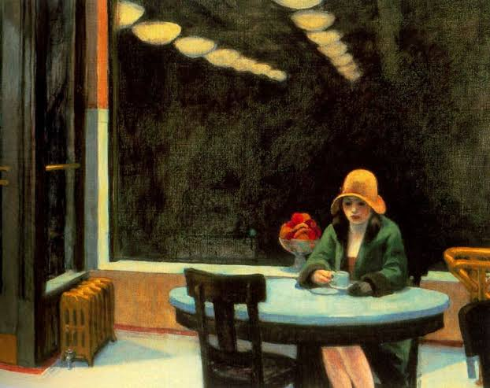
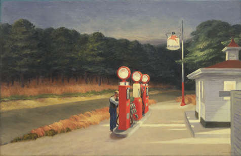
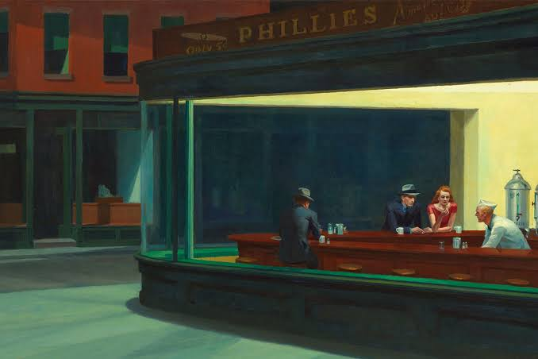
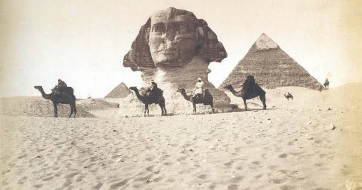
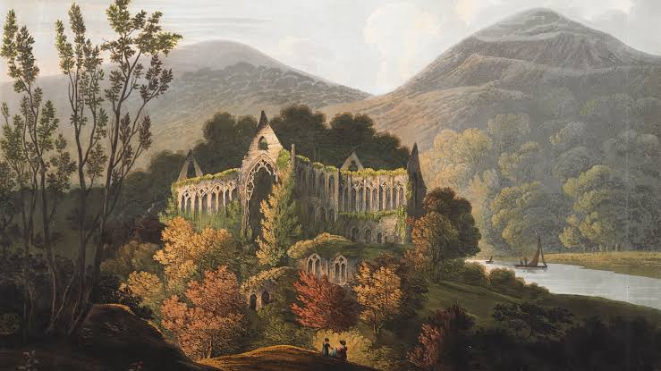
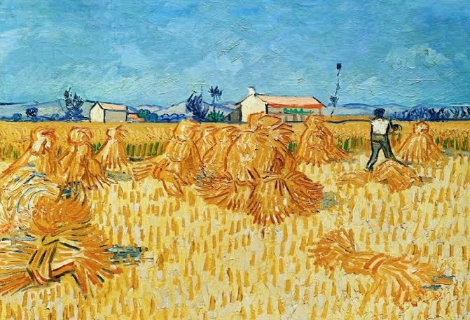
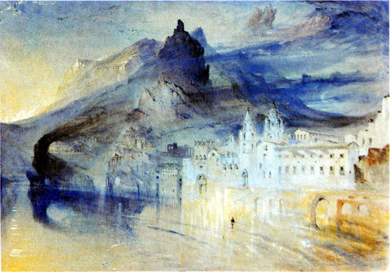

# The Art of Travel
## Alain de Botton

- The world gives us lots of advice on where to travel, but little on why and how.
- Anticipation of travel versus reality. Fictional example of French man seized by Dickens, resolving to travel to London, instead staying in English bookshop and pub in Paris as it is easier and with no risk of ideas being punctured.
- Author travels to Barbados. Fractured images of a destination - palm trees, French doors etc. Travel plans elided in planning, eg “an afternoon’s journey” ignores the reality of sitting on a train in heat, feeling slightly ill, etc. Anticipatory imagination lends a vivid coherence that isn’t present in reality. Layers of experience also compress into convenient narrative in hindsight.

- Gems of travel are diluted by the general society. More concentrated essence of Holland expressed in paintings than in actually being there.
- Images of travel ignore the fact that the traveller will be there too - bringing a body and mind that are temperamental.
- Edward Hopper - American painter who drew inspiration from life on the road (hotels, trains, diners, gas stations). Loneliness a common mood; but sometimes the sense that many people are lonely together in a public place, which is reassuring.

*Automat*:

*Gas*:

*Nighthawks*:

- Travelling eg on a train can provide a distraction that eases introspective thinking.
- Exoticism. Flaubert - very bored in France; longing for the exotic Orient. Exoticism as a motivation for travelling may have two levels: simple differences from home (🐫 vs 🐎), but more deeply, a sense that the differences are attractive because they align more closely with your own temperament. Example of the author travelling to Amsterdam and being captured by the simple, unadorned front doors and tendency for people to leave their curtains open. Flaubert attracted to Egypt because of its embrace of rowdy, bodily worldview vs restrained, prudish French bourgeoisie. Went as far as rejecting nationality of birth and suggesting it is more appropriate for people to select one that matches their identity. Cf Socrates “citizen not of Athens but of the world”.

- Flaubert very keen on imagining stories and emotions of people he saw while travelling. Sonder.
- Curiosity 🏛⛵️. Author contrasts von Humboldt’s voyage of discovery, with careful note taking on cactus size and ocean temperature, to his own experience in Madrid where everything was already known and he felt a bit listless absorbing it from the guidebook. Nietzsche’s idea that facts for their own sake are useless; must be life-improving. Goethe: “I hate that which merely instructs me without augmenting or directly invigorating me.”
- Notes that it’s OK to pick your own itinerary based on things that are meaningful to you; the key sites might have nothing more in common than geography. And to appreciate certain sites may require a lot of preparation: knowing that a facade of a church is in a certain style by a certain architect isn’t meaningful unless you know of those styles etc; the end of a chain of questions connecting to a hub like “why do people build churches”.
- Wordsworth on travelling in nature as an antidote to the competitiveness of city life 🌲🌳🏙. “Lines written above Tintern Abbey”. Aspects of nature may act as inspirations to virtue, eg calmness of large trees, humility of flowers.

- Sublime. Certain landscapes — example used is the Syrian desert — can seem supernatural in the way they provoke a feeling of smallness. “The sublime is a feeling provoked by certain kinds of landscape that are very large, very impressive and dangerous.”...”The way many people speak of landscape as of the late 18th century is often in quasi-religious tones or actively religious tones.”
- Art can help us attune to aspects of a new place that others have focused on. Van Gogh in Provence noticed the fields of Monet, the townsfolk of Vermeer, etc. And in turn the author noticed the blues and yellows of Van Gogh, and the starlight he captured.

*Harvest in Provence*:

- Similarly, trying to actually draw or paint things ourselves, or describe them accurately and without cliche, can help us see them and appreciate them in new ways. John Ruskin’s attention on drawing trees or describing the weather other than simply “wet and windy”.

Ruskin, *View of Amalfi*:

- When we enter a new space, we view many things, but gradually reduce depending on the function we ascribe to the space. Viewing the area where you live, with the same eyes that you use when you travel, can help you find more interest in it — attentiveness to beauty and architecture, thoughts of gratitude or philosophy. Usually instead habituated with a commute or a task. Cf the walk down Ravenswood Lane and Bishops Lane when locked out of house.
- [Review, with some good points](https://www.theguardian.com/books/2002/may/19/travel.highereducation): “He does omit one of abroad's most fulfilling aspects - people. His is a solipsistic quest and he suggests turning to the paintings of Van Gogh if Provence looks a little grey rather than spending time with a group of strangers in a café. Give me five minutes of a man's life over all the books in the world, said Borges”