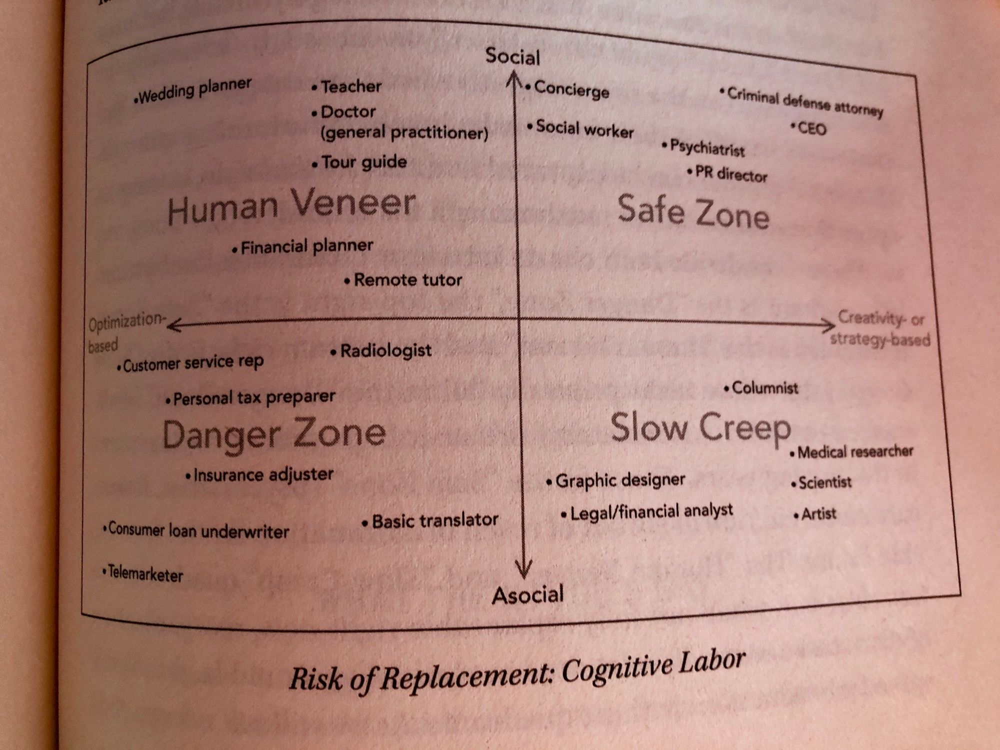
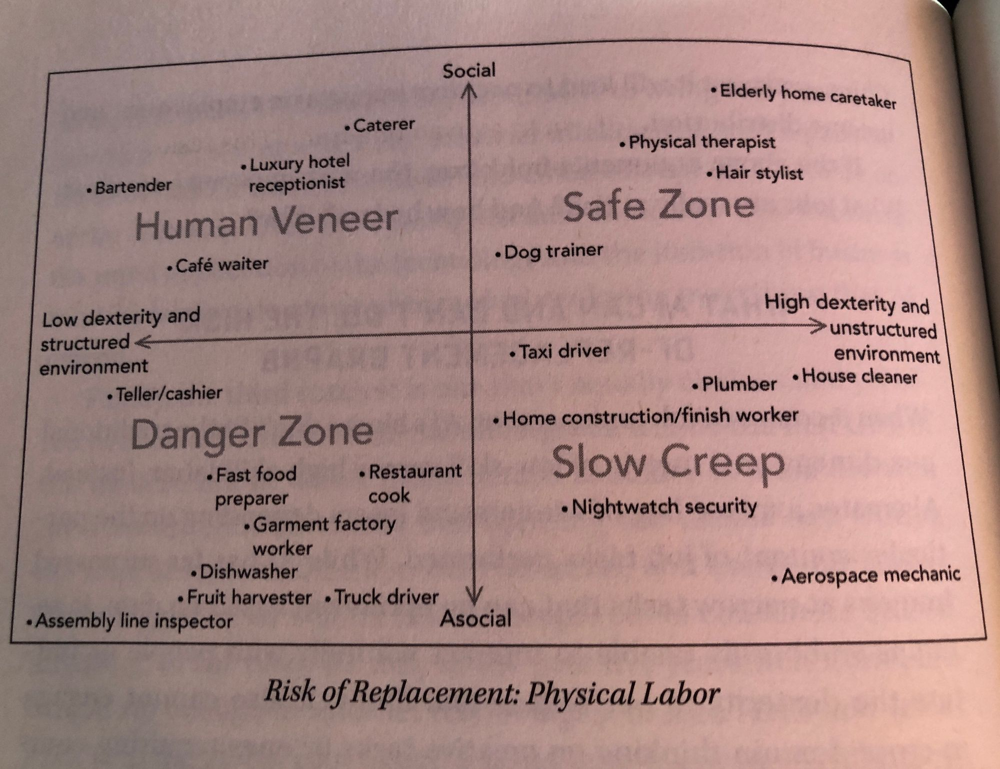

# AI Superpowers
## Kai-Fu Lee

### Chinese vs Western startups

China startup culture is a colosseum where only the most operationally efficient survive, because copying is taken for granted. This copycat culture actually makes Chinese startups stronger, not weaker, though many die along the way. Extreme examples like Renren buying domain similar to Kaixin and claiming they were the “real Kaixin”.

Often real engineering innovation too. Meituan one of many Groupon like startups competing with each other and Groupon itself, most bleeding cash. It focused on backend that would pay sellers faster, building loyalty. Then transformed rapidly to cater to new waves in economy: box office, food delivery, domestic tourism, etc.

US companies have been unwilling to fork to adapt to Chinese market preferences. Google did not launch links in new tab as Baidu did, recognising Chinese habit of browsing around. eBay lost market share when Taobao (part of Alibaba) made listings free.

Chinese govts have invested heavily in building “mass entrepreneurship and mass innovation” - incubators, technology zones, govt backed venture funds, etc. There is inevitably waste but much of it does stick. Intense educational interest in AI in China.

Huge role for “online to offline” tech companies in China. Ride hailing, food delivery, etc - but also haircuts, queueing for hospitals, child school pickups, etc. WeChat as centralised bundled app for all these, rather than many different apps - gives Tencent a massive data advantage. Willingness by Chinese firms to “go heavy” — building out large delivery teams, lots of marketing/signup staff, etc— as opposed to Silicon Valley tendency to want to minimise overheads and deal purely with information (Yelp, Airbnb, etc). [Compare also Ben Evans on next stage of companies needing to go beyond the lightweight info territory.] Widespread use of mobile payments - 50x higher than US — including via QR codes at very small merchants.

Google still has a strong lead in AI research. It has about half of the top 100 AI researchers and engineers. Broadly, its total R&D spending is twice that of US govt math and compsci research [may depend on definition].

### Four waves of AI: 
1. Internet AI: content recommendation engines, news summarisation, etc. Pretty even between 🇺🇸🇨🇳 but 🇨🇳data collection may give it edge over time.
2. Business AI: applied to internal enterprise data. Strong 🇺🇸 lead as 🇨🇳 companies don’t have a culture of systematic data storage or outside consulting. Applications in China may actually be public services eg overstretched doctors and judges.
3. Perception AI: facial recognition etc for commerce, education, law enforcement, etc. Predicts 🇨🇳 accelerating lead due to Chinese nonchalance about data privacy and their hardware manufacturing (eg Shenzhen) integration.
4. Autonomous AI: drones, cars, other robots (eg weed picker). 🇨🇳 building significant infrastructure (new highways, cities) with this in mind. But this area is complex and needs elite researchers, which means 🇺🇸 advantage.

### Coping with AI
Strategies for coping with job displacement. Reduce working hours and spread across workers. Retrain workers. Redistribute income. Rather than UBI, have a social investment stipend that is paid to people engaged in prosocial activities: care, community service, education. Social impact investing that is accepting of linear rather than exponential returns. Private jobs that leverage AI with “human veneer” to create new roles that are more widespread and affordable than current roles: “compassionate caregiver” rather than just doctor. (This dovetails with idea of AI-enabled roles that are currently inaccessible to many.)

His personal experience of cancer diagnosis has emphasised to him the importance of humanistic societies rather than just viewing people as workers. Interesting side note where cancer stages are often oversimplified heuristics that are possible for doctors to remember, rather than being highly predictive: stage IV lymphoma is rated at 50% five year survival, but his specific form was actually more like 90% when you looked at the more accurate indicators.